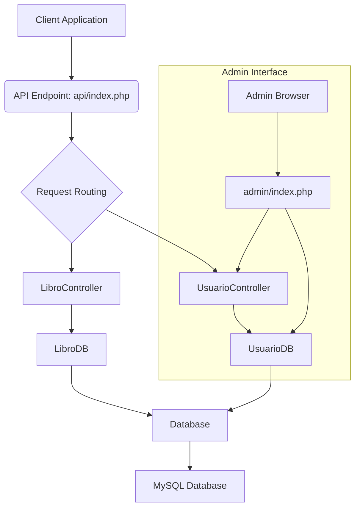

# CodeViz Research Context

> **Note**: This file contains research context from CodeViz. Most recent contexts are at the bottom.

---

## Research Query

show me diagram architecture from proyect

*Session: 6048ad90e4a2fed7b8ea60b77d7f8890 | Generated: 7/3/2025, 8:27:55 AM*

### Analysis Summary

# Project Architecture: ApiBiblioteca

This report outlines the architecture of the `ApiBiblioteca` project, a PHP-based web application designed as an API for a library system. The architecture follows a layered approach, separating concerns into distinct components for better maintainability and scalability.

## High-Level Architecture

The `ApiBiblioteca` project is structured around a central API endpoint that handles requests for book and user management. It leverages a Model-View-Controller (MVC) like pattern, with dedicated controllers for handling business logic and data access objects for interacting with the database.

**Key Components and Their Roles:**

*   **Client Application (node:ClientApplication)**: Represents any external application (e.g., a web frontend, mobile app) that consumes the API.
*   **API Endpoint (file:api/index.php)**: The central entry point for all API requests. It's responsible for initial request processing, routing, and setting up the environment.
*   **Request Routing (node:RequestRouting)**: Logic within `api/index.php` that determines which controller should handle the incoming request based on the URL and HTTP method.
*   **LibroController (file:controllers/libroController.php)**: Handles all business logic related to books, including creating, reading, updating, and deleting book records. It interacts with the `LibroDB` for data persistence.
*   **UsuarioController (file:controllers/usuarioController.php)**: Manages user-related functionalities such as login, registration, and password recovery. It interacts with `UsuarioDB` for user data management.
*   **LibroDB (file:data/libroDB.php)**: A Data Access Object (DAO) responsible for direct interactions with the `libros` table in the MySQL database. It provides CRUD operations for book records.
*   **UsuarioDB (file:data/usuarioDB.php)**: A DAO responsible for direct interactions with the `usuarios` table in the MySQL database. It handles user authentication, registration, and other user-specific data operations.
*   **Database (file:config/database.php)**: Provides the core database connection functionality, used by both `LibroDB` and `UsuarioDB`.
*   **MySQL Database (node:MySQLDatabase)**: The persistent storage for all application data, including books and user information.
*   **Admin Interface (node:AdminInterface)**: A separate web interface (`admin/index.php`) for administrative tasks, which also interacts with the `UsuarioController` and `UsuarioDB` for user management.

## Detailed Component Analysis

### API Endpoint (`api/index.php`)

The **API Endpoint** (file:api/index.php) serves as the front controller for all API requests.

*   **Purpose**: To receive incoming HTTP requests, set up necessary headers (e.g., CORS), parse the request URI, and dispatch the request to the appropriate controller.
*   **Internal Parts**:
    *   **CORS Headers (file:api/index.php:4-10)**: Configures Cross-Origin Resource Sharing to allow requests from various origins.
    *   **Dependency Inclusion (file:api/index.php:14-18)**: Includes `database.php`, `libroDB.php`, and `libroController.php` to make their classes available.
    *   **Request Parsing (file:api/index.php:23-32)**: Extracts the request URI path and HTTP method, and segments the URI for routing.
    *   **Basic Routing and Error Handling (file:api/index.php:36-40)**: Ensures the request path starts with `/api/libros` and returns a `404 Not Found` if not.
    *   **Book ID Extraction (file:api/index.php:42-47)**: Extracts a book ID from the URI if present.
    *   **Controller Instantiation and Request Processing (file:api/index.php:52-60)**: Creates instances of `Database` and `LibroController`, then calls `processRequest()` on the `LibroController`.
    *   **Database Connection Closure (file:api/index.php:63)**: Closes the database connection after the request is processed.
*   **External Relationships**:
    *   Receives requests from **Client Applications** (node:ClientApplication).
    *   Instantiates and delegates to **LibroController** (file:controllers/libroController.php).
    *   Utilizes the **Database** (file:config/database.php) for connection management.

### Controllers

Controllers are responsible for handling specific sets of related requests, processing input, and orchestrating interactions with the data layer.

#### LibroController (`controllers/libroController.php`)

The **LibroController** (file:controllers/libroController.php) manages all operations related to books.

*   **Purpose**: To handle HTTP requests for book management (CRUD operations), validate input, process image uploads, and return appropriate JSON responses.
*   **Internal Parts**:
    *   **Constructor (`__construct`) (file:controllers/libroController.php:11)**: Initializes a `LibroDB` instance and stores the request method and book ID.
    *   **`processRequest()` (file:controllers/libroController.php:18)**: The main method that dispatches requests to specific private methods based on the HTTP method.
    *   **`getAllLibros()` (file:controllers/libroController.php:58)**: Retrieves all books.
    *   **`getLibro($id)` (file:controllers/libroController.php:72)**: Retrieves a single book by ID.
    *   **`createLibro()` (file:controllers/libroController.php:89)**: Creates a new book record, including image handling.
    *   **`updateLibro($id)` (file:controllers/libroController.php:146)**: Updates an existing book record, including image handling.
    *   **`deleteLibro($id)` (file:controllers/libroController.php:203)**: Deletes a book record and its associated image.
    *   **Image Handling Functions (file:controllers/libroController.php:228, 256, 280)**: `guardarImagen`, `eliminarImagen`, `validarImagen` for managing book cover images.
    *   **Data Validation (`validarDatos`) (file:controllers/libroController.php:265)**: Validates incoming book data.
    *   **Error Response Methods (file:controllers/libroController.php:316-352)**: Private methods for generating standardized JSON error responses.
*   **External Relationships**:
    *   Receives requests from the **API Endpoint** (file:api/index.php).
    *   Interacts with **LibroDB** (file:data/libroDB.php) for all database operations related to books.
    *   Manages image files within the `img/peques/` directory.

#### UsuarioController (`controllers/usuarioController.php`)

The **UsuarioController** (file:controllers/usuarioController.php) handles user-related functionalities, primarily authentication and account management.

*   **Purpose**: To manage user login, registration, and password recovery processes, interacting with the `UsuarioDB` for data persistence and session management.
*   **Internal Parts**:
    *   **Session Management (file:controllers/usuarioController.php:2-4)**: Starts a PHP session.
    *   **Dependency Inclusion (file:controllers/usuarioController.php:6-7)**: Includes `database.php` and `usuarioDB.php`.
    *   **`redirigirConMensaje` Function (file:controllers/usuarioController.php:13-20)**: Helper for redirecting with session messages.
    *   **Login Functionality (file:controllers/usuarioController.php:26-39)**: Handles user login, verifies credentials, and sets session variables.
    *   **User Registration Functionality (file:controllers/usuarioController.php:43-54)**: Manages new user registration.
    *   **Password Recovery Functionality (file:controllers/usuarioController.php:58-62)**: Initiates password recovery.
*   **External Relationships**:
    *   Receives requests from the **Admin Interface** (file:admin/index.php) and potentially other client applications.
    *   Interacts with **UsuarioDB** (file:data/usuarioDB.php) for all user-related database operations.
    *   Utilizes the **Database** (file:config/database.php) for connection management.

### Data Access Objects (DAOs)

DAOs abstract the database interactions, providing a clean interface for controllers to perform CRUD operations without direct knowledge of SQL.

#### LibroDB (`data/libroDB.php`)

The **LibroDB** (file:data/libroDB.php) class is the DAO for book records.

*   **Purpose**: To provide a set of methods for interacting with the `libros` table in the database, encapsulating SQL queries and ensuring secure data handling.
*   **Internal Parts**:
    *   **Constructor (`__construct`) (file:data/libroDB.php:10)**: Obtains a database connection.
    *   **`getAll()` (file:data/libroDB.php:16)**: Retrieves all book records.
    *   **`getById($id)` (file:data/libroDB.php:42)**: Retrieves a single book by its ID.
    *   **`create($data)` (file:data/libroDB.php:68)**: Inserts a new book record.
    *   **`update($id, $data)` (file:data/libroDB.php:107)**: Updates an existing book record.
    *   **`delete($id)` (file:data/libroDB.php:162)**: Deletes a book record.
    *   **Prepared Statements**: Consistently uses prepared statements for all parameterized queries to prevent SQL injection.
*   **External Relationships**:
    *   Used by **LibroController** (file:controllers/libroController.php) to perform database operations.
    *   Connects to the **MySQL Database** (node:MySQLDatabase) via the **Database** (file:config/database.php) connection.

#### UsuarioDB (`data/usuarioDB.php`)

The **UsuarioDB** (file:data/usuarioDB.php) class is the DAO for user records.

*   **Purpose**: To manage all database interactions related to user accounts, including authentication, registration, and password recovery.
*   **Internal Parts**:
    *   **Constructor (file:data/usuarioDB.php:14)**: Initializes with a database connection.
    *   **User Retrieval (file:data/usuarioDB.php:21, 38, 60)**: `getAll()`, `getById()`, `getByEmail()`.
    *   **User Creation & Registration (`registrarUsuario`) (file:data/usuarioDB.php:82)**: Handles password hashing and email verification token generation.
    *   **User Updates (file:data/usuarioDB.php:113, 198, 214)**: `update()`, `actualizarUltimoAcceso()`, `cambiarEstadoBloqueado()`.
    *   **User Deletion (`delete`) (file:data/usuarioDB.php:145)**: Deletes user records.
    *   **Authentication & Verification (`verificarCredenciales`, `verificarToken`) (file:data/usuarioDB.php:161, 287)**: Handles login, password verification, and email verification.
    *   **Password Recovery (`recuperarPassword`, `restablecerPassword`) (file:data/usuarioDB.php:228, 258)**: Manages password reset processes.
    *   **Helper Methods (file:data/usuarioDB.php:319, 343, 357)**: `correoExiste()`, `enviarCorreoSimulado()`, `generarToken()`.
*   **External Relationships**:
    *   Used by **UsuarioController** (file:controllers/usuarioController.php) for user management.
    *   Connects to the **MySQL Database** (node:MySQLDatabase) via the **Database** (file:config/database.php) connection.

### Database Configuration (`config/database.php`)

The **Database** (file:config/database.php) file likely contains the `Database` class, which is responsible for establishing and managing the connection to the MySQL database.

*   **Purpose**: To centralize database connection details and provide a consistent way for other components (like DAOs) to obtain a database connection.
*   **External Relationships**:
    *   Used by **LibroDB** (file:data/libroDB.php) and **UsuarioDB** (file:data/usuarioDB.php) to get database connections.
    *   Connects directly to the **MySQL Database** (node:MySQLDatabase).

## Admin Interface

The `admin/` directory houses the administrative interface.

*   **Purpose**: To provide a web-based interface for administrators to manage the library system, including user accounts and potentially other administrative tasks.
*   **Key Files**:
    *   `admin/index.php`: The main entry point for the admin panel.
    *   `admin/login.php`: Handles administrator login.
    *   `admin/logout.php`: Handles administrator logout.
    *   `admin/restablecer.php`: Likely for password reset within the admin panel.
    *   `admin/verificar.php`: Potentially for verifying admin accounts.
    *   `admin/js/sesiones.js`: JavaScript for session management in the admin panel.
*   **External Relationships**:
    *   Interacts with the **UsuarioController** (file:controllers/usuarioController.php) for authentication and user management.
    *   Uses `admin/css/` and `admin/js/` for styling and client-side scripting.

## Other Directories

*   **`css/` (file:css/estilos.css)**: Contains global CSS styles for the application.
*   **`js/` (file:js/funciones.js)**: Contains global JavaScript functions.
*   **`img/`**: Stores images, specifically book covers in `grandes/` and `peques/` subdirectories.
*   **`data/PHPMailer/`**: Contains the PHPMailer library for sending emails, likely used for user registration and password recovery.
*   **`data/correos_simulados.log`**: A log file for simulated emails, indicating that email sending might be mocked for development or testing.
*   **`data/enviarCorreos.php`**: Likely a script for sending emails, possibly using PHPMailer.
*   **`data/libros.txt`**: A text file, possibly for initial data loading or a simple data source.
*   **`index.html`**: A placeholder or a simple landing page for the root of the project.

### Implementation Steps

1. **Understanding the High-Level Architecture**
   The `ApiBiblioteca` project is designed as an API for a library system, following a layered architecture with an MVC-like pattern. It features a central `API Endpoint` that routes requests to specific `Controllers` for business logic, which then interact with `Data Access Objects` (DAOs) to manage data persistence in a `MySQL Database`. A separate `Admin Interface` also interacts with certain controllers for administrative tasks.

2. **Exploring the API Endpoint**
   The `API Endpoint` serves as the primary entry point for all API requests. Its purpose is to receive incoming HTTP requests, configure necessary headers like CORS, parse the request URI, and then dispatch the request to the appropriate `Controller`. It also handles basic routing and error handling, and manages the database connection lifecycle.

3. **Understanding the Controllers**
   Controllers are responsible for handling specific sets of related requests, processing input, and orchestrating interactions with the data layer. The `LibroController` manages all operations related to books, including creating, reading, updating, and deleting records, validating input, and handling image uploads. The `UsuarioController` handles user-related functionalities such as login, registration, and password recovery, managing user data and sessions.

4. **Delving into Data Access Objects (DAOs)**
   Data Access Objects (DAOs) abstract database interactions, providing a clean interface for controllers to perform CRUD operations without direct knowledge of SQL. The `LibroDB` class is the DAO for book records, providing methods for interacting with the `libros` table and ensuring secure data handling through prepared statements. The `UsuarioDB` class manages all database interactions related to user accounts, including authentication, registration, and password recovery.

5. **Managing Database Connections**
   The `Database` component is responsible for establishing and managing the connection to the `MySQL Database`. It centralizes database connection details and provides a consistent way for DAOs like `LibroDB` and `UsuarioDB` to obtain a database connection.

6. **Overview of the Admin Interface**
   The `Admin Interface` provides a web-based interface for administrators to manage the library system, primarily focusing on user accounts. It interacts with the `UsuarioController` for authentication and user management, and includes functionalities for login, logout, and password resets.

7. **Understanding Other Project Components**
   Beyond the core components, the project includes directories for global `CSS` styles and `JavaScript` functions. It also manages `img/` for storing book cover images, and integrates the `PHPMailer` library for sending emails, particularly for user registration and password recovery. There are also files for simulated email logs and potential initial data loading.

